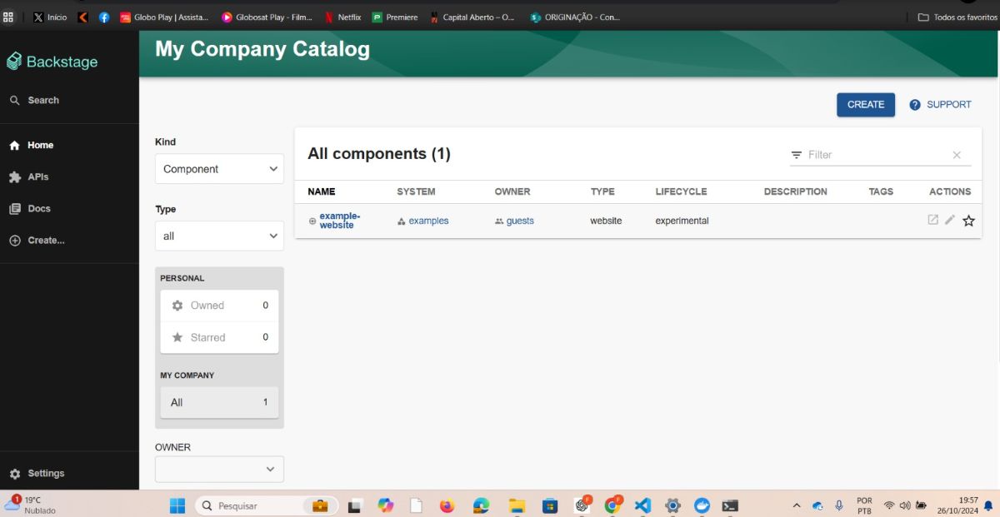

# Implantando o Backstage no Docker

Este projeto demonstra a implantação do [Backstage](https://backstage.io/), uma plataforma aberta para construção de portais de desenvolvedores, utilizando Docker. Seguindo este guia, você construirá uma imagem Docker para Backstage, executará uma instância do aplicativo e acessará sua funcionalidade de catálogo de serviços.

## Índice

- [Pré-requisitos](#prerequisites)
- [Instalação](#installation)
  - [1. Clone o repositório](#1-clone-the-repository)
  - [2. Install Dependencies](#2-install-dependencies)
  - [3. Build the Backstage Backend](#3-build-the-backstage-backend)
  - [4. Build the Docker Image](#4-build-the-docker-image)
- [Rodando Backstage Localmente](#running-backstage-locally)
- [Acessando o catálogo de serviçosg](#accessing-the-service-catalog)
- [Evidências](#screenshots)

## Pré-requisitos

Antes de começar, certifique-se de ter o seguinte software instalado em sua máquina:

- [Docker](https://www.docker.com/get-started) 
- [Yarn](https://classic.yarnpkg.com/en/docs/install)
- [Node.js](https://nodejs.org/) 
- Git

## Instalação

### 1. Clone o repositório

Comece clonando o repositório Backstage. Se você ainda não tem um aplicativo Backstage, pode criar um usando o`@backstage/create-app` CLI.

```
# Clone the Backstage repository
git clone https://github.com/backstage/backstage.git
cd backstage

```

### 2. Instalação de Dependências
Instale as dependências necessárias usando Yarn.

```
yarn install --immutable

```

### 3. Build do Backstage Backend

Gere definições de tipo e construa o pacote de back-end.

```
# Generate type definitions
yarn tsc

# Build the backend with the required configuration

yarn build:backend --config ../../app-config.yaml --config ../../app-config.production.yaml
```

### 4. Build da Docker Image

Garanta que exista um Dockerfile localizando no caminho packages/backend/Dockerfile. Então, faça o build da Docker image da raíz do seu diretório.

```
docker image build . -f packages/backend/Dockerfile --tag backstage
```

## Rodando Backstage Localmente

Após o sucesso do build da image, você poder rodar o backstage localmente.

```
docker run -it -p 7007:7007 backstage
```

Você  deve começar a ver os logs da sua aplicação no terminal que o Backstage está em ação.

## Acessando o catálogo de serviços

Abra seu navegador e vá até a página http://localhost:7007/catalog?filters%5Bkind%5D=component&filters%5Buser%5D=all para acessar o catálogo de serviços.


## Evidências

Abaixo estão os prints com evidências da aplicação backstage em ação.

1. Creating repo with git clone


2. Creating backstage app with npx @backstage/create-app@latest


3. Install the dependencies 


4. Finishing create the app





5. Build backend


